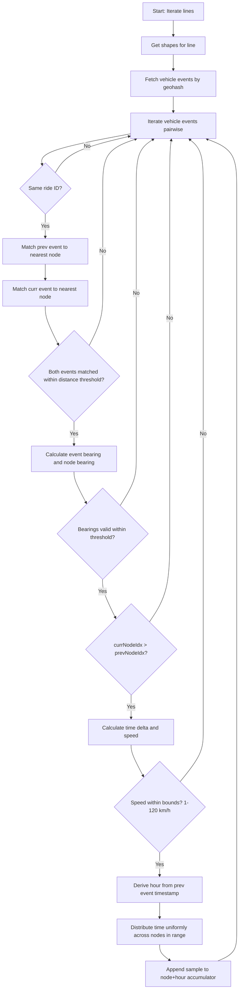
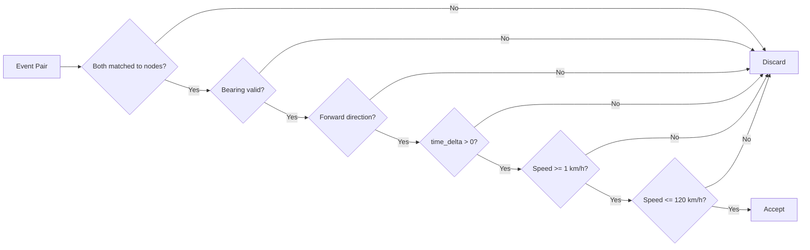
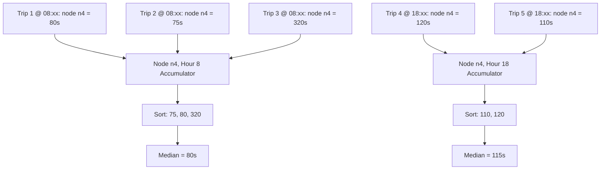

# Segment Time Calculation Algorithm

## Overview

This algorithm estimates per-node travel times along transit route shapes by matching GPS vehicle events to shape nodes and distributing observed time deltas across intermediate nodes.

Each shape is discretized into nodes spaced **25 meters** apart (configurable via `SegmentLengthMeters`). Vehicle events (GPS pings with timestamps) are snapped to the nearest node within a configurable distance threshold (`MaxNodeMatchDistanceMeters`, default 30m). The time between consecutive events on the same ride is distributed uniformly across the traversed nodes, producing a travel time estimate for each segment.

Multiple trip observations are aggregated per node **per hour of day** using the **median**, which is robust against GPS outliers and anomalous readings.

---

## Step-by-Step Guide

1. **Initialize** -- Load configuration, set up ClickHouse and MongoDB clients.
2. **Setup Schema** -- Drop and recreate the `node_travel_times` table in ClickHouse.
3. **Fetch Unique Hashed Shapes** -- Query ClickHouse for unique shape IDs grouped by line.
4. **Generate Line Shapes** -- Fetch shape coordinates from MongoDB, chunk each shape into segment nodes using `ChunkLineIntoSegments()`, and compute geohashes for all segment endpoints.
5. **Process Line Shapes** -- For each line:
   1. Extract geohashes from line shapes and fetch matching vehicle events from ClickHouse.
   2. For each shape on the line, iterate consecutive event pairs within the same ride (`RideId`).
   3. **Match Events to Nodes** -- Snap each event to the nearest shape node within `MaxNodeMatchDistanceMeters`. Skip if either event fails to match.
   4. **Validate Bearing** -- Calculate the bearing between the two events and the bearing between their matched nodes. Skip if bearings diverge beyond `BearingThreshold` (default 90 degrees). Also skip if events bearing is 0 but nodes differ.
   5. **Validate Direction** -- Ensure `currNodeIdx > prevNodeIdx` (forward travel). Discard reversed or zero-delta pairs.
   6. **Validate Speed** -- Calculate speed in km/h from the time and node deltas. Discard if outside the 1--120 km/h bounds.
   7. **Distribute Travel Time** -- Divide the time delta uniformly across nodes in range `[prevNodeIdx, currNodeIdx)`. Append the per-node time as a sample to each node+hour accumulator.
6. **Aggregate Samples** -- For each node+hour combination, compute the **median** of all collected samples across trips.
7. **Build Output Records** -- Emit `NodeTravelTimeRecord` entries with shape ID, node index, hour, coordinates, median travel time, and sample count.
8. **Insert Records** -- Batch insert records into ClickHouse.
9. **Setup Aggregations** -- Create and populate derived tables: shape hourly summary, hourly network summary, node congestion analysis, and shape performance.

---

## Key Concepts

- **Node**: A point on a GTFS shape, spaced at configurable intervals (default 25m) along the route geometry via interpolation.
- **Snapped Node**: The nearest shape node to a GPS event, within `MaxNodeMatchDistanceMeters` (default 30m).
- **Event Pair**: Two consecutive GPS events from the same ride, each matched to a shape node.
- **Segment**: The set of nodes between two snapped events. Travel time is distributed uniformly across this segment.
- **Hour Bucket**: Travel times are grouped by the hour of day (0-23) derived from the previous event's timestamp, capturing time-of-day traffic patterns.

---

## Algorithm Flow



---

## Segment Time Distribution

Given two matched events at nodes `n_a` and `n_b` with timestamps `t_a` and `t_b` (in milliseconds):

```
time_delta  = (t_b - t_a) / 1000    (seconds)
node_delta  = n_b - n_a              (node count)
distance    = node_delta * 25m
speed       = (distance / time_delta) * 3.6   (km/h)
time/node   = time_delta / node_delta
```

Each node in the range `[n_a, n_b)` receives `time/node` as a sample. The travel time at a node represents the cost to traverse **from** that node **to** the next.

### Visual Example

```
Events:    E1 (12:14)             E2 (12:18)
               |                  |
Nodes:  n1  n2  [n3]  n4  n5  [n6]  n7  n8
                  ^            ^
                snapped       snapped

time_delta = 240s
node_delta = 6 - 3 = 3
time/node  = 240 / 3 = 80s

Node n3 → 80s    (time to go from n3 to n4)
Node n4 → 80s    (time to go from n4 to n5)
Node n5 → 80s    (time to go from n5 to n6)
```

---

## Validation & Filtering



### Speed Bounds

| Bound | Value | Rationale |
|-------|-------|-----------|
| Minimum | 1 km/h | Filters stale/stuck GPS readings |
| Maximum | 120 km/h | Upper limit for urban transit vehicles |

### Bearing Validation

The bearing between the two GPS events must align with the bearing between their matched shape nodes, within `BearingThreshold` (default 90 degrees). This filters events where the vehicle is traveling in the opposite direction along the shape (e.g., return trips on the same road).

---

## Aggregation

Multiple trips contribute samples to the same node+hour bucket. The **median** is used over the mean because:

- GPS drift can produce artificially large or small time deltas
- Occasional missed events create outlier segments
- The median is not skewed by a small number of extreme values



In the example above, the same node has different travel times by hour -- 80s during morning and 115s during evening rush -- capturing time-of-day traffic patterns. Trip 3's outlier at 320s is filtered by the median.

### Derived Aggregation Tables

After inserting per-node records, the pipeline creates four derived ClickHouse tables:

1. **`shape_hourly_summary`** -- Per-shape per-hour aggregated travel times
2. **`hourly_network_summary`** -- Network-wide per-hour aggregates
3. **`node_congestion_analysis`** -- Congestion metrics by node and hour
4. **`shape_performance`** -- Shape-level performance metrics (depends on shape_hourly_summary)

---

## Implementation

### Data Structures

```go
// NodeTravelTimeRecord is the final output per shape node per hour of day.
type NodeTravelTimeRecord struct {
    ShapeID           string  `ch:"hashed_shape_id"`
    NodeIndex         int     `ch:"node_index"`
    Hour              uint8   `ch:"hour"`
    Latitude          float64 `ch:"latitude"`
    Longitude         float64 `ch:"longitude"`
    TravelTimeSeconds float32 `ch:"travel_time_seconds"`
    SampleCount       uint32  `ch:"sample_count"`
}

// NodeHourKey uniquely identifies a node within a shape at a specific hour.
type NodeHourKey struct {
    NodeIdx int
    Hour    uint8
}

// NodeAccumulator collects travel time samples for median calculation.
type NodeAccumulator struct {
    Samples []float64
}

// VehicleEvent represents a GPS event from a transit vehicle.
type VehicleEvent struct {
    Id            string  `ch:"_id"`
    AgencyId      string  `ch:"agency_id"`
    CreatedAt     uint64  `ch:"created_at"` // Unix timestamp in milliseconds
    Geohash       string  `ch:"geohash"`
    HashedShapeId string  `ch:"hashed_shape_id"`
    Latitude      float64 `ch:"latitude"`
    Longitude     float64 `ch:"longitude"`
    LineId        uint16  `ch:"line_id"`
    RideId        string  `ch:"ride_id"`
    VehicleId     string  `ch:"vehicle_id"`
}
```

### Node Matching

```go
// MatchEventToNode finds the nearest node to the event and enforces an
// optional maximum distance limit (in meters). Returns the matched
// Coordinate and a boolean indicating success.
func MatchEventToNode(
    event VehicleEvent,
    nodes []Coordinate,
    maxNodeMatchDistanceMeters float64,
) (Coordinate, bool)
```

The function computes Haversine distance from the event to every node, returning the nearest one. If `maxNodeMatchDistanceMeters > 0` and the nearest node exceeds that distance, the match fails.

### Segment Metrics

```go
// computeSegmentMetrics calculates speed and timing metrics for a segment.
func computeSegmentMetrics(
    prevEvent, currEvent *VehicleEvent,
    prevNodeIdx, currNodeIdx int,
) (nodeDelta int, timeDelta float64, distanceMeters float64, speedKmh float64, timePerNode float64)
```

- `timeDelta` converts millisecond timestamps to seconds: `(currEvent.CreatedAt - prevEvent.CreatedAt) / 1000`
- `distanceMeters` = `nodeDelta * 25.0`
- `speedKmh` = `(distanceMeters / timeDelta) * 3.6`
- `timePerNode` = `timeDelta / nodeDelta`

### Core Distribution Function

```go
// distributeSegmentTravelTime calculates per-node travel times between two
// matched events. Assumes uniform speed distribution across equally-spaced
// nodes (25m apart). Discards segments with invalid direction or unrealistic speed.
// The hour is derived from the previous event's timestamp to bucket results by time of day.
func distributeSegmentTravelTime(
    prevEvent, currEvent *VehicleEvent,
    prevNodeIdx, currNodeIdx int,
    shapeID string,
    accumulators map[string]map[NodeHourKey]*NodeAccumulator,
)
```

### Median Calculation

```go
// Median returns the median travel time from collected samples.
func (a *NodeAccumulator) Median() float64 {
    n := len(a.Samples)
    if n == 0 {
        return 0
    }

    sorted := make([]float64, n)
    copy(sorted, a.Samples)
    sort.Float64s(sorted)

    if n%2 == 0 {
        return (sorted[n/2-1] + sorted[n/2]) / 2.0
    }
    return sorted[n/2]
}
```

### Building Final Records

```go
// BuildRecords converts accumulators into final NodeTravelTimeRecord entries.
// Produces one record per shape + node + hour combination.
func BuildRecords(
    accumulators map[string]map[NodeHourKey]*NodeAccumulator,
    shapeNodes map[string][]Coordinate,
) []NodeTravelTimeRecord
```

---

## Outer Loop Integration

```go
for lineID, lineShape := range lineShapesMap {
    geohashes := SetToSlice(lineShape.Geohashes)
    vehicleEvents := clickhouseClient.FetchVehicleEvents(ctx, geohashes, settings)

    for _, shapeID := range hashedShapesByLine.GetShapesByLineID(lineID) {
        shapeNodes, exists := lineShape.Nodes[shapeID]
        if !exists || len(shapeNodes) < 2 {
            continue
        }

        for i := 1; i < len(vehicleEvents); i++ {
            currEvent := vehicleEvents[i]
            prevEvent := vehicleEvents[i-1]

            if currEvent.RideId != prevEvent.RideId {
                continue
            }

            prevEventNode, okPrev := MatchEventToNode(prevEvent, shapeNodes, settings.MaxNodeMatchDistanceMeters)
            currEventNode, okCurr := MatchEventToNode(currEvent, shapeNodes, settings.MaxNodeMatchDistanceMeters)

            if !okPrev || !okCurr {
                continue
            }

            // Bearing validation
            eventsBearing := geo.CalculateBearing(
                Coordinate{prevEvent.Longitude, prevEvent.Latitude},
                Coordinate{currEvent.Longitude, currEvent.Latitude},
            )
            nodesBearing := geo.CalculateBearing(prevEventNode, currEventNode)

            if !geo.IsValidBearing(eventsBearing, nodesBearing, settings.BearingThreshold) {
                continue
            }

            prevNodeIdx := slices.Index(shapeNodes, prevEventNode)
            currNodeIdx := slices.Index(shapeNodes, currEventNode)

            distributeSegmentTravelTime(
                &prevEvent, &currEvent,
                prevNodeIdx, currNodeIdx,
                shapeID, accumulators,
            )
        }
    }
}
```

---

## Configuration

| Parameter | Default | Description |
|-----------|---------|-------------|
| `SegmentLengthMeters` | 25.0 | Distance between segment nodes |
| `MaxNodeMatchDistanceMeters` | 30.0 | Max distance to match an event to a node |
| `BearingThreshold` | 90.0 | Max bearing divergence in degrees (0-180) |
| `MinEvents` | 5 | Minimum events required per ride |
| `GeohashPrecision` | 7 | Geohash precision for spatial queries |
| `WorkerCount` | min(NumCPU, 8) | Parallel workers for processing |
| `BatchSize` | 50 | Lines per batch |

---

## Limitations & Future Improvements

1. **Uniform distribution assumption** -- All nodes receive equal travel time. In reality, vehicles decelerate approaching stops and accelerate leaving them. A future improvement could weight distribution based on proximity to GTFS stops.

2. **No gap detection** -- If two consecutive events are far apart (e.g., GPS blackout through a tunnel), the distributed time may be inaccurate. Consider adding a maximum node delta threshold.

3. **Loop handling** -- Routes with loops may cause ambiguous node matching. The bearing validation mitigates this but doesn't fully resolve it.

4. **Memory usage** -- Storing all samples per node in slices scales linearly with trip count. For very large datasets, approximate median algorithms (P2, reservoir sampling) could reduce memory footprint.
